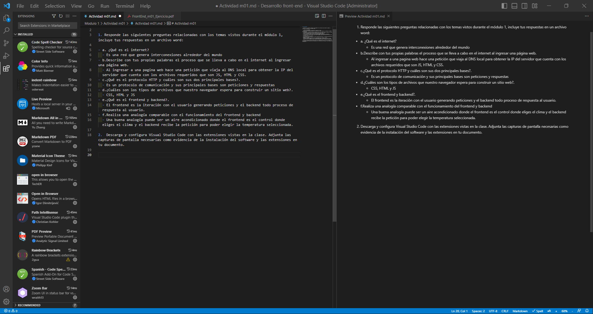

# Actividad m01

1. Responde las siguientes preguntas relacionadas con los temas vistos durante el módulo 1, incluye tus respuestas en un archivo word:

- a. ¿Qué es el internet?
  - Es una red que genera interconexiones alrededor del mundo
- b.Describe con tus propias palabras el proceso que se lleva a cabo en el internet al ingresar una página web.
  - Al ingresar a una pagina web hace una petición que viaja al DNS local para obtener la IP del servidor que cuenta con los archivos requeridos que son JS, HTML y CSS.
- c.¿Qué es el protocolo HTTP y cuáles son sus dos principales bases?.
  - Es un protocolo de comunicación y sus principales bases son peticiones y respuestas
- d.¿Cuáles son los tipos de archivos que nuestro navegador espera para construir un sitio web?.
  - CSS, HTML y JS
- e.¿Qué es el frontend y backend?.
  - El frontend es la iteración con el usuario generando peticiones y el backend todo proceso de respuesta al usuario.
- f.Realiza una analogía comparable con el funcionamiento del frontend y backend
  - Una buena analogía puede ser un aire acondicionado donde el frontend es el control donde eliges el clima y el backend recibe la petición para poder elegir la temperatura seleccionada.

2.  Descarga y configura Visual Studio Code con las extensiones vistas en la clase. Adjunta las capturas de pantalla necesarias como evidencia de la instalación del software y las extensiones en tu documento.

